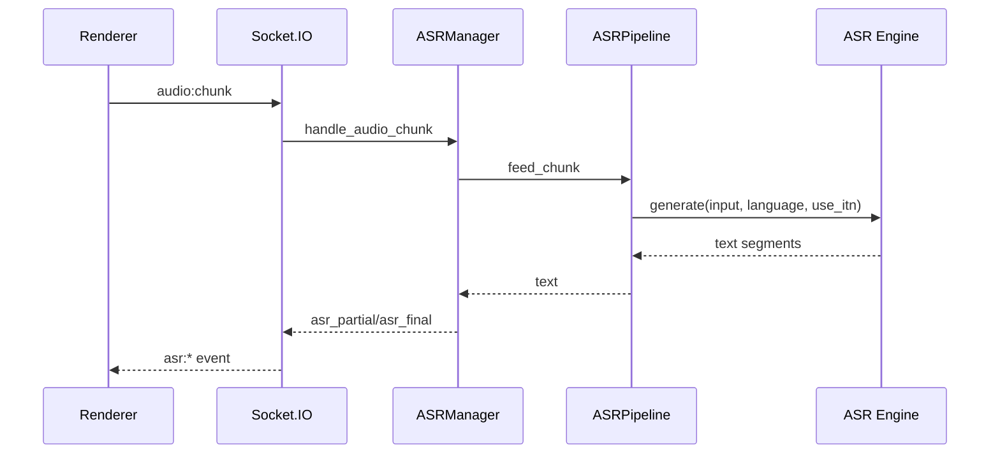

# API Reference

Yuizaki 有三类本地接口:

- Python FastAPI: `http://127.0.0.1:8001`
- Electron 控制服务: `http://127.0.0.1:38945`
- 可选 Playwright MCP: `http://127.0.0.1:7777`

## 鉴权

Python 后端:

- 公开: `/health`, `/audio/*`, `/socket.io/*`, OpenAPI 文档。
- 保护: `/api`, `/memory`, `/v1`, `/vision`, `/svc`, `/system`。
- 保护路由默认需要 `Authorization: Bearer <YUIZAKI_BACKEND_API_TOKEN>`。

Electron 控制服务:

- 公开: `/api/health`。
- 公开只读资源: `/api/pet/assets/live2d/*`, `/api/pet/assets/vrm/*`。
- 其他 `/api/*` 需要控制 token。

`start.bat` 会在未显式配置 token 时生成本轮 token，并传给 Electron、渲染端和后端。

## Python HTTP

### System

| Method | Path | 说明 |
| --- | --- | --- |
| `GET` | `/health` | 后端健康 |
| `GET` | `/api/readiness` | 运行服务 readiness |
| `GET` | `/api/system/capabilities` | 能力快照 |
| `GET` | `/api/system/companion-runtime` | 陪伴运行状态 |
| `GET` | `/api/system/mcp` | MCP 状态 |
| `POST` | `/api/system/mcp` | 添加 MCP 服务 |
| `POST` | `/api/system/mcp/{server_name}/toggle` | 启停 MCP 服务 |
| `GET` | `/api/system/agent-plugins` | 插件状态 |
| `POST` | `/api/system/agent-plugins/{plugin_id}/toggle` | 启停插件 |
| `GET` | `/api/system/schedules` | 计划任务 |
| `POST` | `/api/system/schedules/once` | 创建一次性任务 |
| `POST` | `/api/system/schedules/interval` | 创建循环任务 |

### Settings

| Method | Path | 说明 |
| --- | --- | --- |
| `GET` | `/api/settings/` | 读取设置 |
| `PATCH` | `/api/settings/` | 批量更新设置 |
| `GET` | `/api/settings/{key}` | 读取单项设置 |
| `POST` | `/api/settings/{key}` | 更新单项设置 |
| `DELETE` | `/api/settings/{key}` | 重置单项设置 |
| `POST` | `/api/settings/test/llm` | 测试当前 LLM |
| `POST` | `/api/settings/llm/models` | 拉取模型列表 |
| `POST` | `/api/settings/test/tts` | 测试 TTS |
| `POST` | `/api/settings/import` | 导入设置 |
| `GET` | `/api/settings/export` | 导出设置 |

设置接口会校验 schema，运行时可热更新 `llm`、`tts`、`asr`、`svc`、`summary` 和 `memory`。

### OpenAI-compatible LLM Proxy

| Method | Path | 说明 |
| --- | --- | --- |
| `GET/POST` | `/v1/models` | 当前 LLM provider 模型列表 |
| `POST` | `/v1/chat/completions` | 聊天补全，支持流式 |

Provider 的 Base URL 会被归一化，真实上游调用为 `{base}/models` 与 `{base}/chat/completions`。

### Media

| Method | Path | 说明 |
| --- | --- | --- |
| `POST` | `/vision/ocr` | 上传图片做 OCR |
| `POST` | `/svc/convert` | 上传音频做可选 SVC 转换 |
| `GET` | `/audio/{filename}` | 读取生成音频 |

`/vision/ocr` 使用 `multipart/form-data` 字段 `file`。  
`/svc/convert` 使用 `multipart/form-data` 字段 `file`，可选 `speaker_id` 和 `pitch`。

### Memory

| Method | Path | 说明 |
| --- | --- | --- |
| `GET` | `/memory/docs` | 列出记忆文档 |
| `POST` | `/memory/docs` | 添加文档 |
| `PUT` | `/memory/docs/{doc_id}` | 更新文档 |
| `DELETE` | `/memory/docs/{doc_id}` | 删除文档 |
| `POST` | `/memory/memory/add` | 添加记忆 |
| `GET` | `/memory/index/status` | 索引状态 |
| `POST` | `/memory/rag/query` | RAG 查询 |
| `GET` | `/api/memory/pipeline/query` | pipeline 查询 |

默认后端是 `inmemory`。当 `memory.backend=qdrant` 时，向量写入 Qdrant collection。

## Socket.IO

Socket.IO 挂载在 `/socket.io`。

### 对话

| Event | 方向 | 说明 |
| --- | --- | --- |
| `agent:chat` | 前端 -> 后端 | Agent 对话入口 |
| `llm:request` | 前端 -> 后端 | 直接 LLM 请求 |
| `llm:token` | 后端 -> 前端 | 流式 token |
| `llm:final` | 后端 -> 前端 | 最终文本 |
| `pet:control` | 后端 -> 前端 | 桌宠动作/表情控制 |
| `tts:done` | 后端 -> 前端 | TTS 音频生成完成 |
| `tool:*` | 双向 | 工具执行和状态 |

### ASR

| Event | 方向 | 说明 |
| --- | --- | --- |
| `audio:chunk` | 前端 -> 后端 | 16 kHz mono PCM16 音频块 |
| `asr:partial` | 后端 -> 前端 | partial 转写 |
| `asr:final` | 后端 -> 前端 | final 转写 |
| `asr:vad_start` | 后端 -> 前端 | VAD 检测到开始说话 |

ASR 链路:



## Electron 控制服务

| Method | Path | 说明 |
| --- | --- | --- |
| `GET` | `/api/health` | 控制服务健康 |
| `GET` | `/api/ping` | 代理到 Python 的健康探测 |
| `GET` | `/api/pet/assets/live2d/*` | Live2D 资源读取 |
| `GET` | `/api/pet/assets/vrm/*` | VRM 资源读取 |
| `POST` | `/api/pet/import` | 导入桌宠资源 |
| `POST` | `/api/pet/control` | 控制桌宠动作 |

控制服务负责把 Electron 用户数据目录中的模型资源安全暴露给渲染端，同时代理部分 Python 后端请求。

## Playwright MCP

可选服务由 `node-mcp/server.mjs` 提供:

```bat
start.bat --with-mcp
```

健康检查:

```bat
curl http://127.0.0.1:7777/health
```
