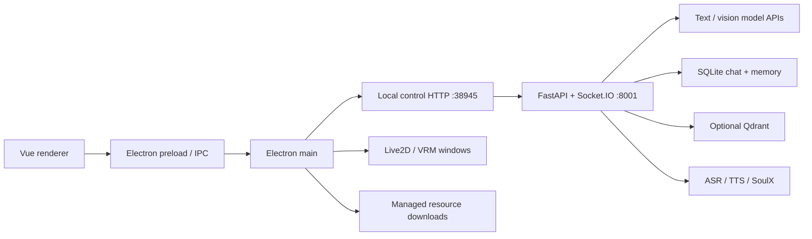
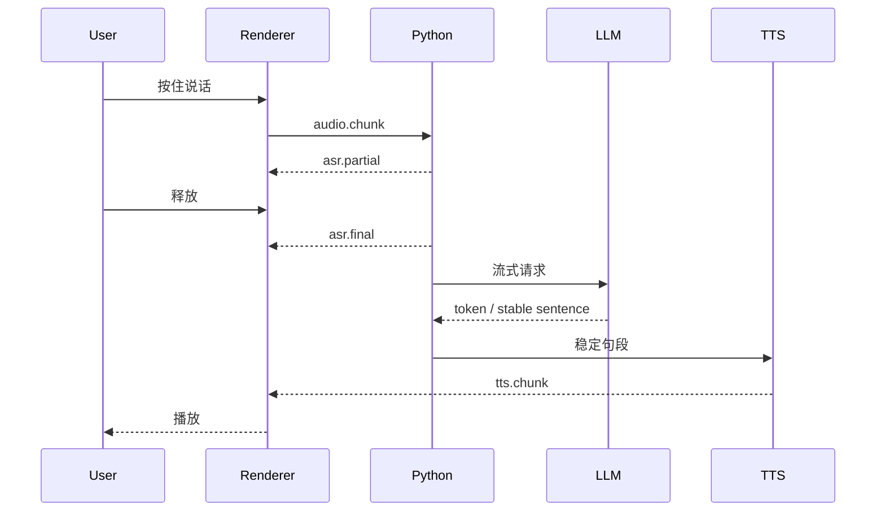

# 架构

维护基线：2026-07-19。

## 产品边界

Yuizaki 的第一界面是桌宠本体，面板用于对话、记忆、技能、语音和高级设置。系统按本地优先设计，但 LLM、视觉、ASR、TTS、嵌入和 SVC 均可连接本地或远程服务。

## 进程组成

### Electron main

- 创建控制面板和透明桌宠窗口
- 执行屏幕捕获、全局输入绑定和受信任 IPC
- 管理 Python、Node MCP、SoulX 等子进程
- 提供本地控制服务、备份恢复和资源下载
- 保持渲染进程启用 context isolation，限制高权限能力

### Vue renderer

- 对话、记忆、技能、资源和设置界面
- Live2D/VRM 显示与桌宠动作状态
- 麦克风、打断、语音播放和端到端延迟展示
- 只通过受控 HTTP、Socket.IO 与 preload API 访问系统能力

### Python backend

- FastAPI REST、Socket.IO 实时事件
- Agent prompt 编译、模型路由、工具权限和结构化桌宠动作
- ASR、VAD、LLM 流式生成、TTS 句段队列和打断
- SQLite 对话、长期记忆、摘要治理和可选 Qdrant
- 实时视觉帧处理和显式 OCR

### Node MCP

独立 Node 服务承载浏览器/MCP 能力，避免把 Playwright 与 Electron 渲染进程混装。依赖和测试位于 `node-mcp/`。

## 语音链路

链路记录 `speech_end`、`asr_final`、`llm_request`、`llm_first_token`、`llm_first_sentence`、`tts_first_chunk`、`playback_start` 和 `interrupt_ack`，聚合 P50/P95。打断会取消 LLM、TTS 和未播放音频。

## 视觉链路

实时视觉与 OCR 是两条独立路径：

1. Electron 捕获屏幕帧。
2. Python 按会话只保留最新帧，限制 10 MiB，默认 TTL 60 秒。
3. 变化检测和用户意图决定是否送入独立视觉模型。
4. 新帧替换旧帧，断开会话时清空内存状态。
5. 需要精确读字时才调用 `/vision/ocr`。

实时视觉默认不生成 PNG 文件，也不建立屏幕历史。未来若增加视觉历史，必须显式授权、设置保留期并提供永久清理。

## Prompt 与 Agent

Prompt 编译顺序按可信度收敛：系统策略、受约束角色配置、会话目标、长期记忆、世界书、视觉证据、插件/工具输出、用户输入。记忆、画面和工具结果都应带来源与时间；它们是数据，不得覆盖系统策略。

桌宠动作使用独立结构化输出，不依赖从自然语言中解析动作。动作执行仍经过前端能力和权限校验。

## 数据与存储

- `chat.db`：会话与消息
- `memory.db`：默认长期记忆权威库
- Qdrant：可选语义后端，不应成为唯一不可恢复来源
- `settings.json`：运行时设置
- `audio_cache/`：受管临时音频
- Electron userData：窗口和桌宠状态

备份、永久清理和模型缓存规则见 [RESOURCE_MANAGEMENT.md](RESOURCE_MANAGEMENT.md)。

## 安全边界

- Python 受保护路由要求 backend token；本地开发绕过必须显式开启。
- Electron 控制服务限定允许来源并校验受信任 IPC 调用方。
- 恢复、删除和导入操作检查受管根目录、realpath 与符号链接。
- 插件权限映射到 route、tool、model 与 agent bridge 范围。
- 下载资源目前仍需固定 revision 和内容 hash，详见 [REPOSITORY_AUDIT.md](REPOSITORY_AUDIT.md)。

## 跨平台

平台差异集中在启动脚本、全局输入、透明窗口、屏幕捕获、沙箱和原生模型轮子。业务协议、配置 schema、数据库与测试保持平台无关。CI 同时验证 Windows 与 Ubuntu Electron 构建，并在 Linux 使用 Xvfb 冒烟启动 GUI。
