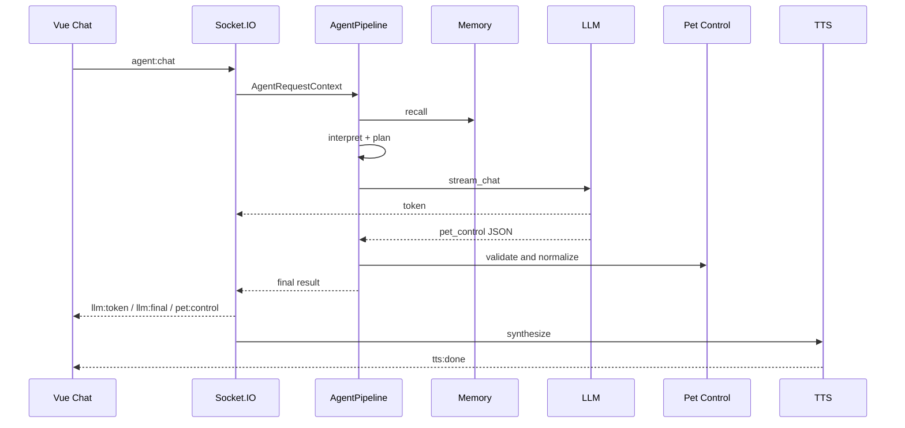
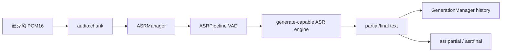

# Architecture

文档状态: 2026-07-07

本文是 Yuizaki 当前技术栈、Agent 设置和联动链路的主说明。旧的一次性开发报告已移除，当前文档只保留可维护事实。

## 技术栈

### Electron/Vue

来自 `electron/package.json`:

| 类别 | 技术 |
| --- | --- |
| 桌面壳 | Electron 42 |
| 前端框架 | Vue 3.5 |
| 构建 | Vite 8, TypeScript 6 |
| 状态与路由 | Pinia 3, Vue Router 5 |
| UI | Element Plus 2 |
| 实时通信 | Socket.IO Client 4 |
| Live2D | Pixi.js 8, easy-live2d |
| VRM/3D | Three.js 0.184, `@pixiv/three-vrm` |
| 测试 | Vitest 4, happy-dom |
| 质量工具 | ESLint 10, Prettier 3, Tailwind CSS 4 |

关键路径:

- `electron/src/main/index.ts`
- `electron/src/main/control-server.ts`
- `electron/src/renderer/stores/chatStore.ts`
- `electron/src/renderer/domains/settings/views/SettingsPanel.vue`
- `electron/src/renderer/pet-renderer.ts`
- `electron/src/renderer/pet-sentence-emotion-scheduler.ts`
- `electron/src/renderer/utils/petControl.ts`

### Python

来自 `python/requirements.txt`:

| 类别 | 技术 |
| --- | --- |
| HTTP 后端 | FastAPI, Uvicorn |
| 实时通道 | python-socketio |
| HTTP 客户端 | httpx |
| 数据库 | SQLAlchemy, Alembic, SQLite |
| 媒体基础 | numpy, Pillow |
| ASR/OCR/TTS | sherpa-onnx, rapidocr-onnxruntime, genie-tts |
| 记忆与向量 | qdrant-client, sentence-transformers, tiktoken |
| 测试 | pytest, pytest-asyncio |
| 类型/格式 | basedpyright, pyright, ruff, black |

关键路径:

- `python/app.py`
- `python/socket_server.py`
- `python/modules/llm/client.py`
- `python/modules/llm/providers.py`
- `python/modules/agent/runtime.py`
- `python/modules/agent/pipeline.py`
- `python/modules/pet_control/parser.py`
- `python/modules/asr/transcriber.py`
- `python/modules/asr/sensevoice.py`
- `python/modules/tts/synthesizer.py`
- `python/modules/system/runtime_services.py`
- `python/modules/system/settings_api.py`
- `python/modules/system/settings_schema.py`

### 可选服务

| 服务 | 路径 | 说明 |
| --- | --- | --- |
| Playwright MCP | `node-mcp/` | Express + Playwright，本地浏览器自动化桥接 |
| SoulX-SVC | `services/soulx-svc/` | Docker 包装的 SoulX-Singer-SVC |
| Qdrant | Docker | 仅 `memory.backend=qdrant` 时使用 |

## Agent 设置

需要区分两件事:

- `AGENTS.md` 是本次 Codex/OMX 开发环境的协作约束，不是 Yuizaki 应用运行时配置。
- Yuizaki 自身的 Agent 运行时由 `python/modules/agent/runtime.py` 创建。

`create_agent_runtime()` 会装配:

| 组件 | 职责 |
| --- | --- |
| `ToolRegistry` | 注册工具 |
| `MCPManager` | 注册和管理 MCP 工具 |
| `PolicyEngine` | 工具权限和风险策略 |
| `ToolExecutor` | 执行本地、插件或 MCP 工具 |
| `StepExecutor` | 执行 planner 产生的 step |
| `AgentPipeline` | 输入标准化、记忆召回、意图识别、规划、执行和结果封装 |
| `AgentTraceStore` | 记录 planner/runtime/steps 轨迹 |
| `PluginManager` | 插件 before/after hook |
| `ScheduleStore`/`AgentScheduler` | 计划任务 |

默认工具来自 `python/modules/agent/default_tools.py`:

- `open_app`
- `open_url`
- `read_file`
- `write_file`
- `web_search`

工具是否能执行由 `PolicyEngine` 和当前上下文共同决定。高风险工具不会绕过策略直接执行。

## Agent 对话链路



关键行为:

- LLM 输出流式发送，用户能看到增量文本。
- `pet_control_context` 把当前 Live2D/VRM 可用表情、动作和参数发送给后端。
- 后端使用 schema/prompt/白名单/兜底多层约束，保证桌宠动作可执行。
- TTS 完成后发送音频 URL，前端驱动播放和口型联动。

## LLM Provider 规范

当前支持:

- `deepseek`
- `qwen`
- `gemini`
- `chatgpt`
- `claude`
- `grok`
- `custom`

统一请求约定:

| 能力 | 路径 |
| --- | --- |
| 模型列表 | `{base}/models` |
| 聊天补全 | `{base}/chat/completions` |

Base URL 会自动移除这些误贴后缀:

- `/models`
- `/chat/completions`
- `/messages`

Claude 目前也按 OpenAI-compatible 链路调用，不走原生 Anthropic Messages API。使用 Claude 时应配置兼容网关或支持该路径的服务端。

## Live2D/TTS 联动

桌宠联动核心字段:

```json
{
  "emotion_id": "happy",
  "motion_group": "Tap",
  "motion_index": 0,
  "intensity": 0.6,
  "duration_ms": 1800
}
```

后端职责:

- 解析 LLM 结构化输出。
- 对照当前 `pet_control_context` 做白名单校验。
- 当模型只输出弱字段时，基于上下文补齐可执行 emotion/motion。
- 无可用动作时避免发送非法 motion。

前端职责:

- 把 `pet:control` 事件转为桌宠控制事件。
- 对 Live2D 执行 expression、motion 和参数变化。
- 对 TTS 音频执行播放和口型调度。

## ASR 链路

ASR 当前由 `python/socket_server.py`、`python/modules/asr/transcriber.py`、`python/modules/core/state.py` 和 `python/modules/asr/sensevoice.py` 共同完成。



支持 provider:

| Provider | 实现 |
| --- | --- |
| `sensevoice-service` | `SenseVoiceServiceClient` |
| `funasr-service` | `SenseVoiceServiceClient` |
| `openai-compatible` | `SenseVoiceServiceClient` |
| `sherpa-onnx` | `SherpaOnnxSenseVoiceClient` |
| `sensevoice-local` | `SenseVoiceClient` |
| `disabled` | 不初始化 ASR |

外部 ASR 服务约定:

- `GET {ASR_BASE_URL}/models`
- `POST {ASR_BASE_URL}/audio/transcriptions`

输入音频约定:

- 16 kHz
- mono
- PCM16 signed int16 little-endian
- 512 samples per chunk

本轮检查修复点:

- 旧实现只把 `sensevoice_client._model` 传入 `ASRPipeline`，服务型客户端必须依赖私有 `_model = self` 约定。
- 现实现通过 `ASRManager._transcription_engine()` 选择具备 `generate(...)` 的引擎，优先本地 `_model`，否则直接使用服务客户端本身。
- 新增测试覆盖“服务客户端没有 `_model` 但实现 `generate(...)`”的场景。

## 记忆与 Qdrant

默认:

```env
MEMORY_BACKEND=inmemory
EMBEDDING_MODEL=Qwen/Qwen3-Embedding-0.6B
```

Qdrant 是可选项:

```env
MEMORY_BACKEND=qdrant
QDRANT_URL=http://127.0.0.1:6333
QDRANT_AUTO_START=1
```

启动策略:

- `inmemory`: 不启动 Qdrant。
- `qdrant` 且本地 HTTP URL: `start.bat` 调用 `scripts/ensure_qdrant_docker.ps1` 检查并拉起 Docker。
- `qdrant` 且远程 URL: 不自动拉本地 Docker。
- `--no-qdrant`: 本轮启动禁用 Qdrant 自动拉起。

切换 embedding 模型或维度后，应删除旧 collection 或新建 collection，然后重新写入向量。

## 设置系统

设置来源:

- 环境变量: `python/.env`
- 持久设置: `python/config/settings.json`
- 前端设置面板: 写入 settings API

热更新范围:

- `llm`
- `tts`
- `asr`
- `svc`
- `summary`
- `memory`

敏感值处理:

- API Key 不应出现在文档中。
- 设置读取接口会做敏感值脱敏。
- 导入/导出配置时应人工确认是否包含真实 key。

## 验证命令

ASR:

```bat
cd python
.venv\Scripts\python.exe -m pytest tests\test_asr_pipeline.py tests\test_voice_service_clients.py -q
```

设置/记忆:

```bat
cd python
.venv\Scripts\python.exe -m pytest test_settings_api_router.py test_memory_backend_factory.py tests\test_memory_routes.py -q
```

前端:

```bat
cd electron
npm run lint
npm run type-check
npm test
```

启动脚本:

```bat
start.bat --check --no-qdrant
```

## 清理原则

可删除:

- 日志
- pytest/cache
- `__pycache__`
- 临时研究克隆
- 临时截图/生成图
- 过时交接文档

不可删除:

- Live2D/VRM 模型
- Genie/Sherpa/HuggingFace 模型缓存
- SoulX 模型和参考音频
- 用户数据库
- 用户配置和 API Key
