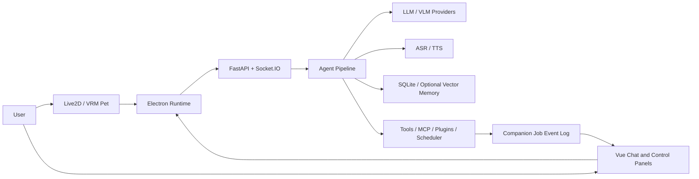

# Yuizaki

Yuizaki is a local-first desktop AI companion agent. It combines a transparent Live2D or VRM pet window with chat, realtime voice, optional on-demand vision, memory, tools, MCP, scheduling, and visible Agent Job traces.

The project is designed around three separate runtime lanes:

- **Audio**: microphone capture and playback stay on the realtime audio path. AudioWorklet is used when available, with a ScriptProcessor fallback for older runtimes.
- **Interaction**: ASR, LLM, TTS, tool calls, cancellation, and interruption are bound to `sessionId`, `turnId`, `requestId`, and `interruptionEpoch`.
- **Presentation**: Live2D/VRM animation, lip-sync, gaze, expressions, and idle behavior are driven locally from high-level targets. The model is not asked to generate animation frames.

## What Works

- Transparent, draggable desktop pet window with Live2D and VRM adapters.
- Startup restoration of the last selected pet model.
- Push-to-talk and realtime voice turns with streaming ASR, incremental responses, ordered TTS playback, lip-sync, and barge-in cancellation.
- Chat sessions with independent generation identity, background completion, unread state, and visible Agent steps.
- MCP, built-in tools, plugins, scheduler, heartbeat, and visual capture represented as cancellable Job events.
- Job trace details: status, progress, tool name, result summary, duration, artifact references, failure, cancellation, and retry state.
- Local memory with confidence, trace identity, model version, correction, and forget actions.
- Vision is opt-in and request-scoped: no permanent screenshot loop is started by default.
- Hardware-aware pet rendering: DPR cap, power preference, active/idle FPS tiers, hidden-window pause, and coalesced pointer input.
- MCP starts by default from the normal launcher. Use `--no-mcp` only when explicitly needed.

## Architecture



`electron/` owns windows, input, rendering, audio transport, and UI. `python/` owns the Agent pipeline, model routing, voice, vision, memory, tools, and scheduling. `node-mcp/` is the optional browser/MCP service.

## Requirements

- Windows 10/11 or x86_64 Linux
- Python 3.11-3.13
- Node.js 22.13 or newer
- 8 GiB RAM minimum; 16 GiB recommended for local models
- Docker is optional for Qdrant or external voice services

Older compatible dependency versions are preferred where they do not remove required runtime behavior. The repository keeps platform-specific Python lockfiles and a resource lock at `resources.lock.json`.

## Quick Start

### Windows

```powershell
.\install.bat core
.\start.bat
```

The normal launcher performs a full startup and enables MCP. Useful options:

```powershell
.\start.bat --check          # preflight only
.\start.bat --verify         # type checks, build, and tests without launching
.\start.bat --dev-renderer   # run the renderer through Vite
.\start.bat --with-qdrant   # start Qdrant when Docker is available
.\start.bat --no-mcp         # opt out of the default MCP service
```

### Linux

```bash
./install.sh core
./start.sh
```

The Linux launcher also starts MCP by default. Use `./start.sh --check` for a non-launching preflight.

### Model configuration

Copy `python/.env.example` to `python/.env` and configure at least one text provider:

```dotenv
LLM_PROVIDER=custom
LLM_BASE_URL=http://127.0.0.1:11434/v1
LLM_API_KEY=local
LLM_MODEL=your-model
```

OpenAI-compatible local servers such as Ollama or LM Studio can use the same shape. Never commit real API keys.

## Runtime Behavior

### Voice and latency

Microphone capture uses 16 kHz mono PCM in approximately 32 ms batches. The audio worklet only buffers and transfers samples; network and UI work stay outside the realtime audio thread. TTS lip-sync follows the audio playback clock through `requestAnimationFrame`.

Interruption immediately cancels the active turn, clears queued audio, returns lip-sync to neutral, increments `interruptionEpoch`, and rejects late ASR/LLM/TTS results.

### Vision

Vision is explicit and request-scoped. A screenshot is captured only after an Agent turn requests visual context, analyzed once, and then released. There is no always-on desktop capture loop.

### Job and trace visibility

Every tool, scheduler, heartbeat, and visual operation has a bounded Job lifecycle:

`created -> running/progress -> completed | failed | cancelled | interrupted`

Progress events are coalesced within a short window to reduce socket and UI pressure. Terminal events are never coalesced. Chat messages show the user-facing summary; the Agent Trace panel provides the global view.

## Data and Privacy

Default local data locations:

| Data | Location | Behavior |
| --- | --- | --- |
| Chat history | `python/data/chat.db` | Local persistent storage |
| Long-term memory | `python/data/memory.db` | Local, correctable, forgettable |
| Settings | `python/config/settings.json` | Local runtime settings |
| TTS cache | `python/audio_cache/` | Temporary and removable |
| Vision frames | memory | Request-scoped; no default history |

When a cloud model is selected, the configured provider receives the corresponding text, image, or audio payload. Local models can keep those payloads on the device.

## Verification

Electron focused checks:

```powershell
cd electron
npm run type-check
npm run lint
npm test
npm run build
```

Python checks should use explicit test paths when the workspace contains restricted temporary directories:

```powershell
cd python
python -m pytest -q tests python/test_*.py
python -m compileall -q modules app.py socket_server.py
```

The launcher also supports `--verify` for the supported end-to-end preflight path.

## Project Status

Yuizaki is an active development project intended for local deployment and experimentation. The core companion loop is implemented, while provider-specific model quality, packaging, and broad hardware coverage still require machine-level validation.

## References

The current interaction and latency direction is informed by active upstream projects and 2024-2026 research, including:

- [Project AIRI](https://github.com/moeru-ai/airi)
- [AIRI DevLog](https://airi.moeru.ai/docs/en/blog/DevLog-2026.03.14/)
- [W3C Web Audio API](https://www.w3.org/TR/webaudio-1.1/)
- [MDN AudioWorklet](https://developer.mozilla.org/en-US/docs/Web/API/AudioWorklet)
- [LTS-VoiceAgent (2026)](https://arxiv.org/abs/2601.19952)
- [Endpoint Anticipation for Low-Latency Spoken Dialogue (2026)](https://arxiv.org/abs/2606.13450)
- [HumDial Full-Duplex Study (2026)](https://arxiv.org/abs/2604.21406)
- [Moshi-Face (2026)](https://arxiv.org/abs/2606.21970)

See `docs/ARCHITECTURE.md`, `docs/API.md`, `docs/QUICKSTART.md`, and `SECURITY.md` for implementation and operational details.

## License

Source code is released under the [MIT License](LICENSE). Live2D/VRM models, voices, fonts, artwork, and downloaded model weights may have separate licenses; review `THIRD_PARTY_NOTICES.md` before redistribution.
