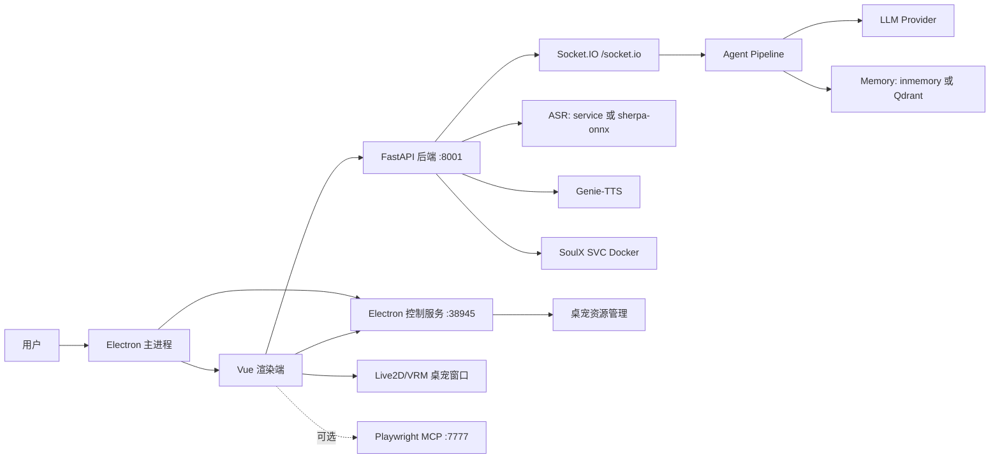

# Yuizaki

文档状态: 2026-07-07  
维护入口: 本仓库以中文文档为准。

Yuizaki 是一个 Windows-first 的本地 AI 桌宠 agent。它把 Electron/Vue 桌面壳、Python FastAPI 后端、Socket.IO 实时对话、LLM/Agent、Live2D/VRM 桌宠、TTS/ASR/OCR/SVC、记忆系统和可选 MCP 工具桥接放在同一个本地角色体验里。

## 当前定位

- 默认对话界面使用中文。
- TTS 默认使用日文 `ja`，也支持按模型输出语言或设置切换。
- 记忆默认使用 SQLite 作为可审计的权威存储；`inmemory` 仅用于临时运行，Qdrant 是可选向量检索增强。
- Embedding 默认模型为 `Qwen/Qwen3-Embedding-0.6B`。
- LLM 提供商包括 DeepSeek、Qwen、Gemini、ChatGPT、Claude、Grok 和自定义。当前统一按 OpenAI-compatible 方式调用 `{base}/models` 与 `{base}/chat/completions`。
- ASR 默认走外部 SenseVoice/FunASR OpenAI-compatible 转写服务，也可切换到本地离线 `sherpa-onnx` 或真流式 `sherpa-onnx-online`。
- 资源页分别管理离线 SenseVoice 和流式 Zipformer2 CTC；流式安装会先用 sherpa-onnx 完成真实加载校验，再写入可用标记。

## 仓库结构

| 路径 | 说明 |
| --- | --- |
| `electron/` | Electron 主进程、Vue 渲染端、桌宠窗口、Live2D/VRM 运行时、控制服务、插件沙箱和前端测试 |
| `python/` | FastAPI 后端、Socket.IO 服务、Agent/LLM/TTS/ASR/OCR/SVC、设置、数据库、记忆和后端测试 |
| `node-mcp/` | 可选 Express + Playwright MCP 桥接服务，默认 `127.0.0.1:7777` |
| `services/soulx-svc/` | 可选 SoulX-Singer-SVC Docker 服务，默认 `127.0.0.1:7861` |
| `scripts/` | `start.bat` 使用的启动和检查辅助脚本 |
| `data/`, `python/data/` | SQLite 运行数据 |
| `python/.cache/`, `python/CharacterModels/`, `services/soulx-svc/models/` | 本地模型、TTS、ASR 和 SVC 资源 |

## 架构概览



## 快速启动

```bat
install_full.bat
start.bat --check
start.bat --verify
start.bat
```

常用模式:

```bat
start.bat --no-qdrant
start.bat --with-mcp
start.bat --dev-renderer
start.bat --smoke
```

`start.bat` 会启动 Python 后端、Electron 控制服务、桌宠层和可选 MCP。若 `memory.backend=qdrant` 且 Qdrant URL 是本地 HTTP 地址，启动器会按设置尝试拉起 Docker Qdrant；如果保持默认 `inmemory`，不会强依赖 Qdrant。

详细安装和启动见 [QUICKSTART.md](QUICKSTART.md) 与 [ENVIRONMENT_SETUP.md](ENVIRONMENT_SETUP.md)。

## 主要链路

### LLM/Agent/Live2D/TTS

1. 渲染端发送 `agent:chat`。
2. Python Socket.IO 服务创建本轮 Generation。
3. Agent Pipeline 组装上下文、记忆、工具、MCP 和桌宠能力白名单。
4. LLM 以流式方式返回文本，并在可用时返回 `pet_control`。
5. 后端校验 `emotion_id`、`motion_group`、`motion_index`、`intensity`、`duration_ms`。
6. 完整句段会在 LLM 结束前进入串行 TTS 队列，渲染端按 generation 和 sequence 顺序驱动音频、口型与句级情绪。
7. 打断会同时取消 LLM、请求 Genie-TTS 停止本地推理、等待旧推理线程退出并清空播放队列；ACK 前后迟到的旧 generation 音频不会重新入队。

### ASR

1. 前端采集 mono PCM16 音频并发送 `audio:chunk`。浏览器实际输入若为 44.1/48 kHz，会先流式重采样并聚合为后端要求的 16 kHz、512 样本块；展开的语音控制区显示音轨实际采用的 AEC、降噪和 AGC 回执。
2. `ASRManager` 交给 `ASRPipeline` 做 VAD；端点静音按语句长度缩短，并根据同一会话中恢复说话前的停顿习惯动态保护，默认上限 300ms。
3. VAD 起点需要连续 3 个 32ms 语音块确认；确认后的 `asr:vad-start` 会在桌宠生成或说话时触发同一套 LLM、TTS 和播放队列取消链路，短促单帧噪声不会直接打断。
4. 在线 provider 创建持久识别流并持续增量喂入音频；离线 provider 按自适应频率生成 partial，并在端点后提交 final。设置页只展示当前后端真正使用的语言提示、VAD 和 partial 控件。
5. `sensevoice-service`/`funasr-service`/`openai-compatible` 调用 `${ASR_BASE_URL}/audio/transcriptions`。
6. `sherpa-onnx` 使用离线 SenseVoice ONNX；`sherpa-onnx-online` 使用兼容的在线 Zipformer2 CTC 模型和 tokens。
7. 模型路径留空时按 provider 选择独立的托管目录，离线与流式模型不会互相复用；资源页可安装官方小型中文 int8 流式模型。
7. final 文本写入会话历史并发送 `asr:final`。

### 记忆

默认使用 SQLite 保存权威记忆、来源和状态；需要独立向量服务时再切换 Qdrant，`inmemory` 只适合临时测试。切换到 Qdrant 后应重建 collection 并重新写入向量，避免 embedding 维度或模型版本不一致。

## 资源边界

例行清理可以删除日志、缓存和临时测试产物，但不要删除以下资源:

- `python/.cache/GenieData/`
- `python/.cache/sherpa-onnx/`
- `python/.cache/huggingface/`
- `python/CharacterModels/`
- `python/audio_cache/` 中仍需保留的生成音频
- `electron/src/renderer/public/live2d/`
- `electron/dist/renderer/live2d/`
- `services/soulx-svc/models/`
- `services/soulx-svc/references/`
- `data/` 和 `python/data/` 中的真实数据库

## 文档入口

- [ARCHITECTURE.md](ARCHITECTURE.md): 技术栈、Agent 设置、LLM/Live2D/TTS/ASR/记忆链路。
- [QUICKSTART.md](QUICKSTART.md): 安装、配置、启动和常见问题。
- [ENVIRONMENT_SETUP.md](ENVIRONMENT_SETUP.md): 环境变量、资源目录和运行环境。
- [API.md](API.md): HTTP 与 Socket.IO 接口摘要。
- [PRODUCT.md](PRODUCT.md): 产品定位与设计原则。

## 验证

```bat
cd python
.venv\Scripts\python.exe -m pytest tests\test_asr_pipeline.py tests\test_voice_service_clients.py -q

cd ..\electron
npm run lint
npm run type-check
npm test

cd ..
start.bat --check --no-qdrant
```
