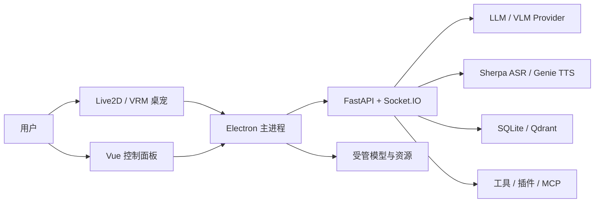

<p align="center">
  
</p>

<p align="center">
  本地优先、可扩展的跨平台 AI 桌宠 Agent
</p>

<p align="center">
  <a href="https://github.com/Rivulet138/yuizaki/actions/workflows/ci.yml"></a>
  <a href="LICENSE"></a>
  
  
  
</p>

Yuizaki 让 Live2D/VRM 角色常驻桌面，并围绕角色整合实时语音、屏幕视觉、长期记忆、工具调用、MCP 和插件。数据默认保存在本机；文本、视觉、语音和嵌入模型既可以使用本地服务，也可以连接用户选择的云端提供方。

> [!IMPORTANT]
> 当前项目处于开发预览阶段，适合开发测试和个人部署。公开分发前仍需完成安装包签名、模型/素材授权复核和更多真实设备验证。

## 核心能力

| 能力 | 当前实现 |
| --- | --- |
| 桌面角色 | Live2D、VRM、透明置顶窗口、拖拽、缩放、动作与表情 |
| 实时语音 | 按住说话、流式 ASR、分句 TTS、播放打断和端到端延迟指标 |
| 屏幕视觉 | 关键帧变化检测、独立 VLM、按需 OCR、会话级最新帧 |
| 长期记忆 | SQLite 权威存储、摘要与关系信息、可选 Qdrant 语义检索和 reranker |
| Agent | 工具调用、权限确认、执行记录、计划任务、MCP 和插件 |
| 本地优先 | 对话、记忆和设置默认本地持久化；实时视觉默认不保存截图历史 |
| 可复现运行 | 项目内 `python/.venv`、平台 lock、模型资源 lock、Windows/Linux CI |

## 系统结构



Electron 负责窗口、全局输入、屏幕能力和本地进程；Python 服务负责 Agent、模型路由、语音、视觉、记忆和工具策略；Node MCP 服务隔离浏览器自动化能力。详细边界见 [ARCHITECTURE.md](ARCHITECTURE.md)。

## 模型与运行时

| 类别 | 默认或推荐方案 | 说明 |
| --- | --- | --- |
| LLM | OpenAI 兼容接口 | 支持 DeepSeek、Qwen、OpenAI、xAI、Ollama、LM Studio 和自定义服务 |
| 原生 LLM 协议 | Claude、Gemini | 分别使用 Anthropic Messages 与 Gemini 原生接口 |
| VLM | 独立 OpenAI 兼容视觉端点 | 与文本模型分开配置，默认低细节以降低延迟 |
| ASR | Sherpa Streaming Zipformer | 本地流式、体积较小；SenseVoice/FunASR 为显式可选项 |
| OCR | RapidOCR ONNX Runtime | VLM 不可用或需要精确读字时使用 |
| TTS | Genie TTS | 支持懒加载、后台预热、分句合成和中断 |
| SVC | SoulX Singer SVC | 作为可选 Docker 外部服务隔离重型依赖 |
| Embedding | Qwen3 Embedding 0.6B | 可选 Qdrant 检索和 CrossEncoder 重排 |

模型文件按需下载，来源、revision、大小和校验信息由 [`resources.lock.json`](resources.lock.json) 管理。完整技术选型见 [TECH_STACK.md](TECH_STACK.md)，质量指标见 [MODEL_EVALUATION.md](MODEL_EVALUATION.md)。

## 快速开始

### 环境要求

- Windows 10/11 或 x86_64 Linux
- Node.js 22.13 以上，推荐 24 LTS
- Python 3.12 或 3.13
- 最低 8 GiB 内存，推荐 16 GiB
- Docker 可选，仅 Qdrant、SoulX 等外部服务需要

### 安装

Windows：

```powershell
.\install_core.bat
```

Linux：

```bash
./install_core.sh
```

安装脚本会创建并使用仓库内 `python/.venv`，Node 依赖使用 `npm ci`，Python 依赖使用对应平台 lock。核心安装不会强制下载所有模型。

### 配置文本模型

首次安装会从 `python/.env.example` 创建 `python/.env`。至少配置一个文本模型：

```dotenv
LLM_PROVIDER=custom
LLM_BASE_URL=https://example.com/v1
LLM_API_KEY=replace-me
LLM_MODEL=your-model
```

不要提交真实密钥。本地 Ollama、LM Studio 或其他 OpenAI 兼容服务也使用这组配置。

### 启动

```powershell
.\start.bat
```

```bash
./start.sh
```

仅检查环境和启动链而不启动服务：

```powershell
.\start.bat --check
```

完整语音、视觉、记忆和本地模型配置见 [QUICKSTART.md](QUICKSTART.md)。Linux 依赖与显示服务说明见 [LINUX.md](LINUX.md)。

## 数据与隐私

| 数据 | 默认位置 | 行为 |
| --- | --- | --- |
| 对话 | `python/data/chat.db` | 本地持久化 |
| 长期记忆 | `python/data/memory.db` | 本地持久化，可永久删除 |
| 设置 | `python/config/settings.json` | 本地持久化，密钥通过受控接口管理 |
| TTS 音频 | `python/audio_cache/` | 临时缓存，可清理 |
| 实时视觉帧 | 内存 | 会话级替换，默认不建立截图历史 |
| 模型 | 受管资源目录 | 不进入默认用户数据备份 |

如果选择云端模型，对应文本、图像或音频会发送给所配置的服务提供方。资源卸载、备份和永久删除边界见 [RESOURCE_MANAGEMENT.md](RESOURCE_MANAGEMENT.md)，安全模型见 [SECURITY.md](SECURITY.md)。

## 开发与验证

Electron：

```powershell
cd electron
npm ci
npm run type-check
npm run lint
npm test
npm run build
```

Python（Windows）：

```powershell
cd python
.\.venv\Scripts\python.exe -m pytest -q
.\.venv\Scripts\python.exe -m pyright --pythonversion 3.12
.\.venv\Scripts\python.exe -m evals
```

仓库契约：

```powershell
python scripts/check_docs.py
python scripts/check_resources.py
python python/scripts/check_requirements_lock.py
```

CI 在 Windows/Ubuntu 验证 Electron，并在 Python 3.12/3.13 上运行依赖、类型、测试和离线模型评测。Python 直接依赖已按平台精确固定；完整传递依赖 hash lock 仍是后续供应链工作。

## 项目目录

| 路径 | 职责 |
| --- | --- |
| `electron/` | Electron 主进程、Vue 控制面板、Live2D/VRM 桌宠 |
| `python/` | FastAPI、Socket.IO、Agent、模型、语音、视觉和记忆 |
| `node-mcp/` | 独立浏览器 MCP 服务 |
| `services/soulx-svc/` | 可选 SoulX Singer SVC 服务 |
| `scripts/` | 环境检查、开发启动、模型与资源验证 |
| `resources.lock.json` | 模型和外部资源的可审计来源 |

## 文档

| 文档 | 内容 |
| --- | --- |
| [QUICKSTART.md](QUICKSTART.md) | 完整安装、首次配置与常见问题 |
| [ARCHITECTURE.md](ARCHITECTURE.md) | 进程、核心链路和数据边界 |
| [TECH_STACK.md](TECH_STACK.md) | 技术栈、模型选型和同类项目参考 |
| [ENVIRONMENT_SETUP.md](ENVIRONMENT_SETUP.md) | 环境变量与运行时配置 |
| [API.md](API.md) | HTTP、Socket.IO 与控制接口 |
| [RESOURCE_MANAGEMENT.md](RESOURCE_MANAGEMENT.md) | 模型下载、缓存、备份和清理 |
| [DEPENDENCIES.md](DEPENDENCIES.md) | 依赖锁、升级和供应链策略 |
| [MODEL_EVALUATION.md](MODEL_EVALUATION.md) | ASR、TTS、LLM、Embedding 评测 |
| [LINUX.md](LINUX.md) | Linux 运行和桌面环境支持 |
| [SECURITY.md](SECURITY.md) | 安全边界与漏洞报告 |
| [THIRD_PARTY_NOTICES.md](THIRD_PARTY_NOTICES.md) | 第三方代码、模型、字体和素材许可 |

## 设计原则

- 桌宠本体是主要交互界面，控制面板只负责对话、管理和配置。
- 模型可替换，但 provider 差异收敛在适配器边界。
- 高影响工具必须经过权限判断和用户确认。
- 模型按需下载，固定来源并验证内容。
- 用户数据默认本地保存，并提供备份和永久删除能力。
- 实时体验优先测量首 token、首音频、RTF、打断成功率和工具成功率。

## 参考项目

Yuizaki 的模块化模型层和语音交互参考了 [Open-LLM-VTuber](https://github.com/Open-LLM-VTuber/Open-LLM-VTuber)；角色优先、多运行时和 MCP 方向参考了 [Project AIRI](https://github.com/moeru-ai/airi)。Yuizaki 当前更聚焦本机桌面常驻、受控系统能力、长期记忆和可审计资源管理。

## 许可

源代码使用 [MIT License](LICENSE)。Live2D/VRM 模型、字体、角色图片、声音和下载模型适用各自许可，分发前请阅读 [THIRD_PARTY_NOTICES.md](THIRD_PARTY_NOTICES.md)。
